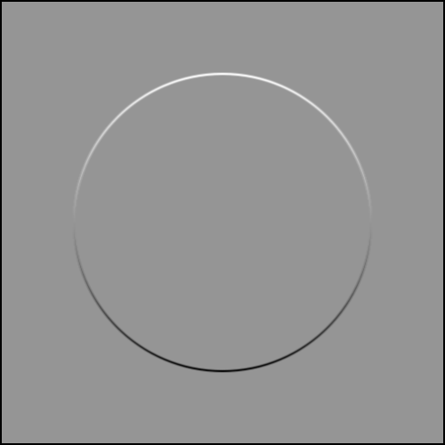
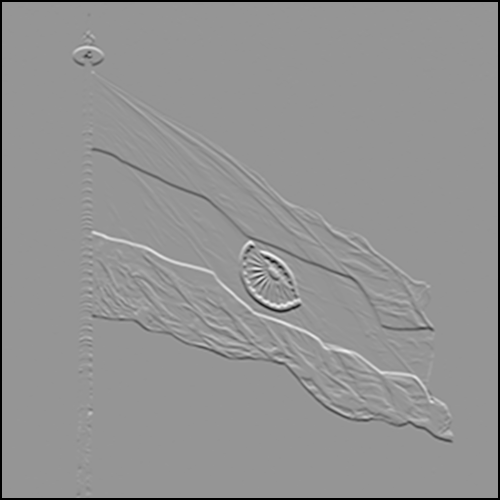

# Computer Vision Algorithms

This project is dedicated to showcase some of the algorithms and concepts used in computer vision.

## Examples

|   Pre Edge-Detection    |        Post Edge-Detection         |
| :---------------------: | :--------------------------------: |
|     |  |
|  |   |
